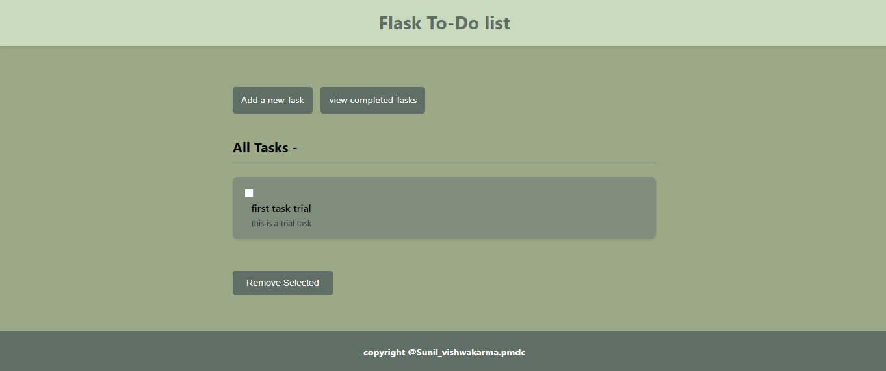
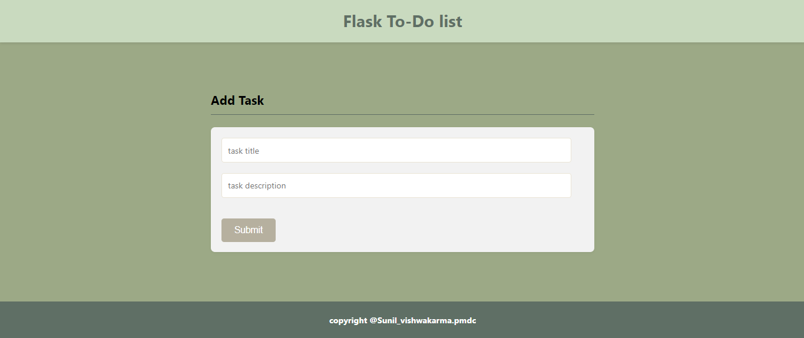
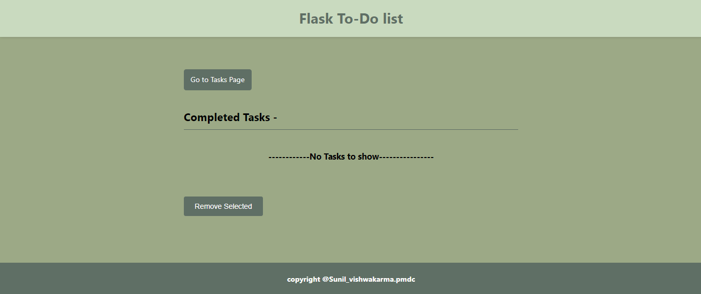
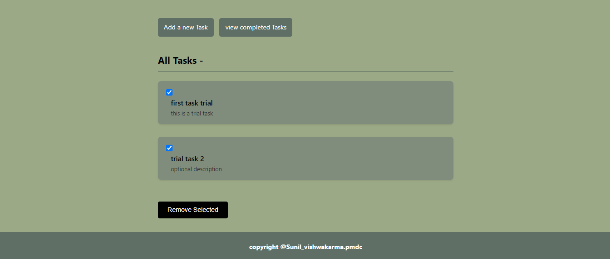

# 📝 To-Do List Web App (Flask)

A clean and minimalistic **To-Do List App** built with **Flask**, **Flask-WTF**, and **SQLAlchemy**.  
It lets you add, complete, and delete tasks with a simple user interface.

---

## 🚀 Features

- ➕ Add new tasks with title and optional description
- ✅ Mark tasks as completed
- 🗑️ Automatically moves completed tasks to a separate list
- ❌ Delete completed tasks
- 💾 Stores tasks using SQLite
- 🧠 Built with Flask, SQLAlchemy, Flask-WTF, and Bootstrap
- 📱 Fully Responsive on mobile (Feels like an app)

---

## 📸 Screenshots

```html
<h2>Screenshots</h2>

Main screen  


Add Task Page  


Completed Tasks  


Remove Completed Tasks  



🛠️ Setup Instructions
📦 Requirements
Python 3.8+

pip package manager

🧱 Install dependencies

pip install -r requirements.txt
Create a virtual environment first (recommended):
python -m venv .venv
source .venv/bin/activate  # Linux/Mac
.venv\Scripts\activate     # Windows


⚙️ Setup .env file
Create a .env file in the root directory with:

env
SECRET_KEY=your_secret_key
DATABASE_URI=sqlite:///mydatabase.db

🚦 Run the App
python main.py
Then open your browser at http://localhost:5000

🗃️ Project Structure
📁 to-do-app/
│
├── templates/
│   ├── index.html
│   ├── add_task.html
│   └── completed_tasks.html
│
├── static/
│   └── style.css
│
├── main.py
├── requirements.txt
└── .env

📄 License
This project is licensed under the MIT License.
Feel free to use, modify, or contribute to it!

🙌 Contributing
Pull requests are welcome. For major changes, please open an issue first to discuss what you'd like to change.

💬 Contact
Built with 💻 by [Sunil Vishwakarma].
